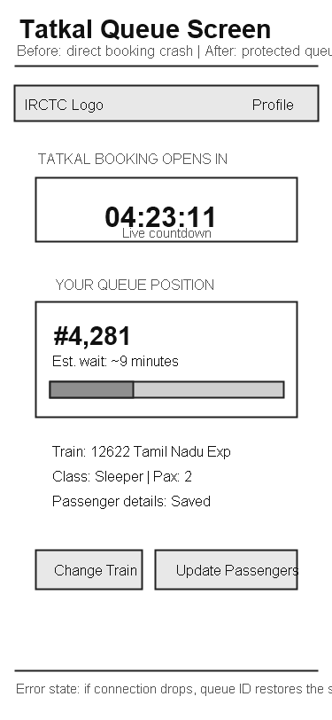
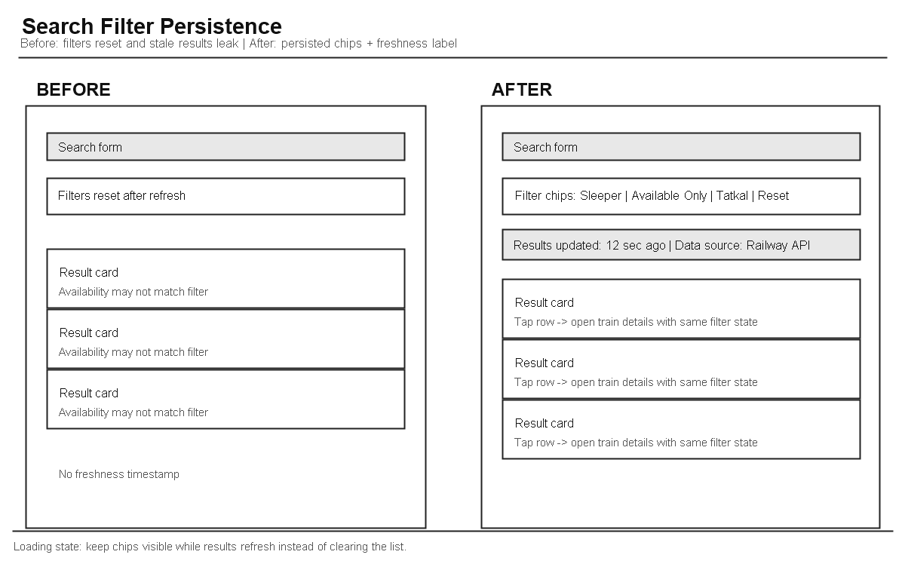
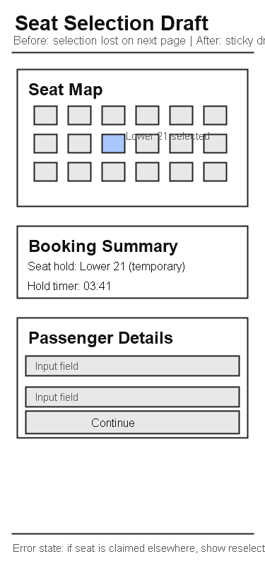
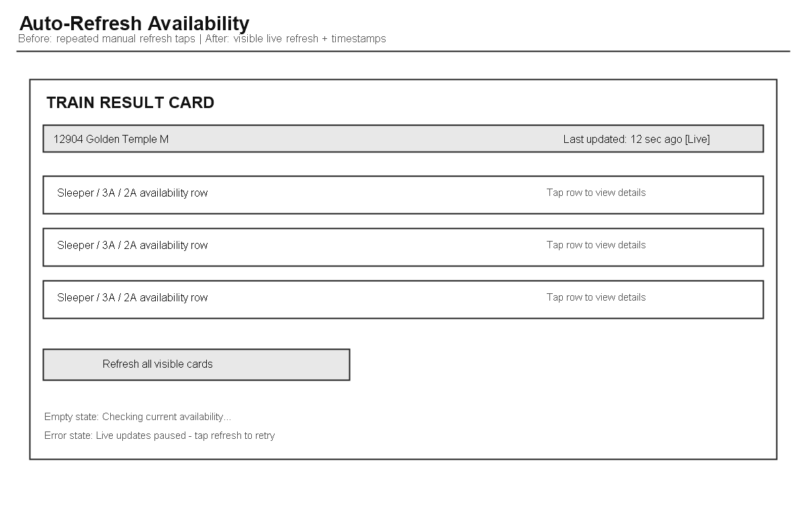
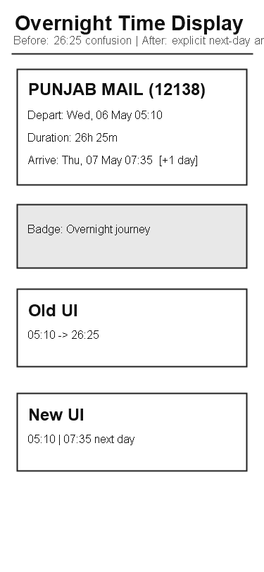
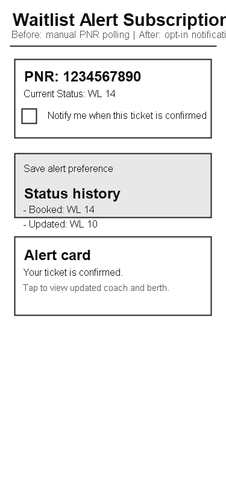

# IRCTC Feature Specifications - Part B

This document continues directly from [part-a/PROBLEMS.md](../part-a/PROBLEMS.md). Each spec below maps one Part A pain point into a buildable product and engineering plan.

---

## Feature Spec 1: Tatkal Virtual Queue System

### Problem Statement
Part A Problem 1 shows that Tatkal bookings collapse at 10:00 AM, when 20-40 lakh users hit the same booking path and the system offers no feedback during the freeze. Users complete the earlier steps, then lose the booking at payment or session timeout with no explanation of whether the request succeeded, failed, or was ever processed.

### Current State (from Part A)
The broken flow happens at steps 4-6 in Part A Problem 1. The user submits the booking just before Tatkal opens, the page freezes at exactly 10:00 AM, then the session drops and the user is forced to restart without knowing whether the seat was reserved or the payment was attempted.

### Proposed Solution
Replace the direct-hit Tatkal booking page with a virtual queue. Users who arrive before or during the Tatkal window get a queue position, a live wait estimate, and a visible turn indicator. When their slot opens, they get a short, protected booking window so the transaction can complete without competing against the entire crowd at once.

### Proposed User Flow - Step by Step
1. User opens Tatkal booking before 10:00 AM or within the queue window.
2. System assigns a queue ID and shows a live position plus estimated wait time.
3. Countdown updates while the user stays in queue; the page stays light and does not load the full booking form yet.
4. When the queue reaches the user, the booking form opens with passenger data already preloaded.
5. User completes seat selection and payment inside a 90-second protected session.
6. If the timer expires, the slot is released and the next queued user is promoted.
7. If the browser disconnects briefly, the user can reconnect with the same queue ID and resume state.

### Wireframe

*Caption: Proposed Tatkal virtual queue screen - mobile view* 

### Technical Implementation Plan
**System components affected:**
- Frontend Tatkal search and booking pages.
- Backend queue service that gates the booking flow.
- Redis or equivalent in-memory store for queue ordering and claim locks.
- Booking API and payment handoff flow.
- Observability and alerting for queue saturation and release failures.

**New data requirements:**
- `queue_id`, `user_id`, `train_id`, `quota`, `joined_at`, `expires_at`, `position_snapshot`, `status`.
- Temporary booking claim record with `claim_token`, `claim_expires_at`, and `session_reference`.
- Metrics records for queue entry, promotion, expiration, and successful booking conversion.

**API changes:**
- `POST /tatkal/queue/join` -> creates a queue slot and returns queue metadata.
- `GET /tatkal/queue/status/:queueId` -> returns position, estimated wait, and turn state.
- `POST /tatkal/queue/claim` -> converts a queue turn into a short booking claim.
- WebSocket channel `tatkal:queue:{queueId}` -> pushes live position updates and turn notifications.

**Frontend changes:**
- Add a queue waiting state before the full booking form loads.
- Add a live position component, timer, and reconnect state.
- Add fallback polling when realtime updates fail.
- Persist queue ID in local storage or session storage so refresh does not lose the slot.

**Third-party services (if any):**
- Redis for queue ordering and claim expiry.
- Socket.IO or equivalent WebSocket transport for live position updates.

### Success Metrics
- Tatkal booking completion rate increases from 40% to at least 70% during peak windows.
- Server error rate at 10:00 AM drops from about 35% to under 5%.
- Queue-related user complaints drop by 80% within 30 days of launch.

### Edge Cases and Constraints
- If Redis fails, the system must fail open to the existing flow instead of blocking all bookings.
- If the browser disconnects, the user must be able to recover the same queue position.
- If the claim timer expires, the next user must be promoted automatically and safely.
- The Railway seat reservation API still has to be called at booking time; the queue only controls access to that step.
- 2G and unstable mobile connections need a polling fallback if realtime updates are unavailable.

---

## Feature Spec 2: Search Filter Persistence and Server-Validated Results

### Problem Statement
Part A Problem 2 shows that train filters do not reliably apply, reset on refresh, and sometimes show results that do not match the selected class or quota. This affects nearly everyone who searches for trains and creates a direct trust problem because the interface says one thing while the result set behaves differently.

### Current State (from Part A)
The failure occurs at steps 3-6 in Part A Problem 2. The user applies filters, the page reloads, the filter state disappears, and stale quota or availability data can still leak into the filtered list.

### Proposed Solution
Keep the user’s chosen filters visible and persistent across refreshes. Apply the filters on the server instead of trusting only the client, and show a freshness badge so users can see how recently the results were validated.

### Proposed User Flow - Step by Step
1. User searches source, destination, and date.
2. Results load with filter chips already reflecting the current selection.
3. User changes class, quota, or availability and the list updates without losing state.
4. If the page refreshes, the same filters return automatically.
5. A freshness label tells the user when the results were last validated.
6. If the backend data is stale, the UI shows a warning instead of pretending the result is live.

### Wireframe

*Caption: Before-and-after search results layout with persisted filter chips and freshness label*

### Technical Implementation Plan
**System components affected:**
- Search results frontend.
- Search API query handling.
- Cache layer or result hydration layer.
- Session state handling for filter persistence.

**New data requirements:**
- Persisted filter payload with `class`, `quota`, `availability`, `sort`, and `departure_window`.
- Result metadata fields such as `freshness_timestamp`, `data_source_version`, and `cache_age_seconds`.

**API changes:**
- `GET /trains/search?...filters...` -> accepts filter parameters server-side and returns filtered results.
- `GET /trains/search/state` -> optional endpoint to restore saved filters for the user session.
- Search response should include freshness metadata and the exact filter set applied.

**Frontend changes:**
- Store active filters in session storage and mirror them in the URL query string.
- Rehydrate filters on reload or back navigation.
- Show filter chips, a refresh timestamp, and a stale-data warning state.
- Apply loading skeletons instead of clearing the list on each refresh.
- Use a unique session ID to prevent multi-tab filter collision (cross-tab storage events to sync state).
- Set filter expiry to 30 minutes of inactivity; after that, offer the user a "restore previous search" prompt instead of silently resuming stale filters.

**Third-party services (if any):**
- None required.

**Rate Limiting Assumptions:**
- Assume Railway API allows up to 100 filtered search queries per minute per user; the spec does not add polling, only persistence and server-side filtering on the initial request and on user action.
- If the backend sees rate-limit errors, fall back to client-side filtering on cached results with a visible "results may be stale" warning.

### Success Metrics
- Filter reset complaints drop by at least 70% (measure via support tickets and in-app feedback forms).
- Search abandonment after applying a filter drops by 25% (measure via analytics comparing "filter applied" → "no booking initiated" within 5 minutes; caveat: this assumes other factors remain constant, so A/B test is recommended).
- Users spend less time reapplying filters across repeated search sessions (measure via session cohort analysis: average time between filter application and booking, across users who search 2+ times in a week).

### Edge Cases and Constraints
- If filtered results return empty, the UI must explain whether it is a true no-match or a stale-data issue. Show an inline prompt: "Try clearing the 'Quota' filter to see more options" instead of just "No results found."
- On low bandwidth connections, the page should preserve the current filter state even if live refresh fails. If the search API times out after 3 seconds, show the cached results with a "Connection slow — results may be outdated" banner and a manual retry button.
- The Railway API can still return mixed freshness, so the UI should display a data age warning instead of implying certainty. If the API response is > 5 minutes old, do not apply the filter; instead, prompt the user to "Refresh availability" before filtering.
- Filters must survive refresh without leaking one user's search state into another session. Use a session token in the filter payload, and discard filters if the session token expires (30-minute inactivity timeout).
- Multi-tab filtering: if the user opens the same search in two tabs and applies different filters, the second tab's action takes precedence, and both tabs sync via a storage event listener.

---

## Feature Spec 3: Seat Selection Persistence with Temporary Hold

### Problem Statement
Part A Problem 3 shows that seat choices are lost between the seat map and passenger details pages, especially on mobile. This is harmful for families, elderly passengers, and users with accessibility needs because a lower berth or preferred seat can silently become auto-assigned or be overwritten.

### Current State (from Part A)
The failure happens at steps 3-5 in Part A Problem 3. The user selects a berth, navigates forward, and the seat value is lost because it only lived in local component state instead of a durable booking draft.

### Proposed Solution
Keep the selected seat locked to the booking draft until the user either confirms the booking or abandons the session. Show the selected seat everywhere in the flow so the user can see exactly what will be booked, and warn them immediately if the seat becomes unavailable before payment.

### Proposed User Flow - Step by Step
1. User taps a seat in the map and sees it pinned in a summary panel.
2. The system creates a temporary seat hold linked to the booking draft.
3. User moves to passenger details and sees the same seat in a sticky summary header.
4. If the seat is still available, the booking confirms it on final submit.
5. If the seat is taken by another user before submit, the UI prompts the user to reselect instead of silently switching to auto.
6. If the device rotates or the page refreshes, the draft restores from server state.

### Wireframe

*Caption: Seat map and passenger details draft with persistent seat hold summary*

### Technical Implementation Plan
**System components affected:**
- Seat map frontend.
- Passenger details page.
- Booking draft persistence layer.
- Seat hold and release logic in the backend booking service.

**New data requirements:**
- Draft record with `draft_id`, `user_id`, `train_id`, `class`, `seat_number`, `seat_hold_id`, `hold_expires_at`, and `draft_status`.
- Seat hold record with `status` values like `held`, `confirmed`, `released`, or `expired`.

**API changes:**
- `POST /booking/draft` -> creates or restores a booking draft.
- `POST /booking/draft/seat` -> stores the chosen seat and creates a temporary hold.
- `GET /booking/draft/:id` -> restores the draft on refresh or device rotation.
- `POST /booking/confirm` -> final confirmation using the held seat.

**Frontend changes:**
- Keep seat selection in a shared booking store instead of component-local state.
- Display the selected seat in a sticky summary on both screens.
- Rehydrate the draft on navigation, refresh, or orientation change.
- Show an explicit error state when a selected seat is lost.

**Third-party services (if any):**
- None required.

### Success Metrics
- Seat preference retention improves from the current 75-85% range to above 95%.
- Manual back-navigation caused by seat resets drops by at least 60%.
- Lower berth satisfaction for eligible users improves because seat choice is no longer silently overwritten.

### Edge Cases and Constraints
- The seat may become unavailable while the user is filling the passenger form; the system must interrupt and reselect instead of auto-switching.
- Mobile re-renders and orientation changes must not clear the draft.
- Temporary holds must expire automatically so inventory is not locked forever.
- If the booking service is offline, the UI should preserve the draft locally and retry, but never pretend the hold is confirmed.

---

## Feature Spec 4: Auto-Refresh Availability with Freshness Indicator

### Problem Statement
Part A Problem 4 shows that users must click refresh repeatedly across train cards and class rows just to know whether availability is current. This creates repetitive work, especially for flexible travelers comparing multiple classes, and it hides the age of the data from the user.

### Current State (from Part A)
The failure occurs at steps 3-8 in Part A Problem 4. Each class row is manually refreshed, the page gives no freshness timestamp, and the user has to repeat the same action dozens of times to compare options.

### Proposed Solution
Refresh availability automatically for visible train cards and label every card with a freshness timestamp. Keep a manual refresh button only as a fallback, not as the default workflow, so the user can compare options without constant clicking.

### Proposed User Flow - Step by Step
1. User opens results and sees the last update time for each train card.
2. The visible cards auto-refresh at a controlled interval.
3. The freshness label changes from “just updated” to “x sec ago” as the data ages.
4. If the user scrolls, the system refreshes the newly visible cards in the background.
5. If auto-refresh fails, the manual button remains available with an explanation.

### Wireframe

*Caption: Before-and-after train result card showing live freshness and auto-refresh behavior*

### Technical Implementation Plan
**System components affected:**
- Search results frontend card rendering.
- Availability fetch layer and polling scheduler.
- Backend search endpoint batching, if supported.
- Rate limiting and caching controls.

**New data requirements:**
- `last_refreshed_at` per train card and per class row.
- Optional `refresh_state` field such as `loading`, `live`, `stale`, or `error`.

**API changes:**
- `GET /trains/availability?train_ids=...` -> returns batched class availability and freshness metadata.
- Existing class-refresh endpoints should include the server timestamp of the returned data.

**Frontend changes:**
- Replace repeated per-class refresh taps with visible auto-refresh for active rows.
- Use visibility-aware polling so offscreen cards do not waste network calls.
- Show timestamps, loading states, and retry states.
- Set auto-refresh interval to 15 seconds for visible cards (configurable server-side to adapt to Railway API rate limits).
- Disable auto-refresh on cellular connections with latency > 200ms or when the page is backgrounded; show a manual "Refresh" button with last-update time instead.
- On 2G or poor connections: fall back to manual refresh only, no auto-polling. Show a banner: "Live updates disabled on slow connection."

**Third-party services (if any):**
- None required.

**Rate Limiting Assumptions:**
- Assume Railway API allows up to 50 availability queries per train per minute. If we have 15 visible trains and poll every 15 seconds, that's 60 queries/min total — at the limit. The implementation must use batching (`GET /trains/availability?train_ids=...`) or risk hitting rate limits. If rate-limited, switch to 30-second polling and show a "Availability updates slowed" message.

### Success Metrics
- Manual refresh clicks per search session drop by at least 80% (measure via analytics: event count for "refresh button clicked" before vs. after launch).
- Time spent on search results page before proceeding to booking drops by 2-3 minutes on average (measured as session cohort percentile: median time from search-results-loaded to booking-page-loaded).
- Conversion rate after viewing auto-refreshed availability increases by at least 8% (measure via A/B test: control = old manual refresh, variant = new auto-refresh; caveat: this improvement assumes users trust fresher data, but may be offset by other factors like availability volatility, so monitor closely).
- Availability data shown is never stale by more than 20 seconds on average (instrument the availability API response timestamps and track difference vs. client clock).

### Edge Cases and Constraints
- Auto-refresh should pause or slow down on weak connections or when the page is backgrounded. Stop polling if the browser tab is hidden for > 10 seconds, and resume when the tab regains focus. On connection latency > 200ms, switch to 30-second intervals instead of 15.
- The Railway API may rate-limit availability checks, so batching and visibility-based polling are required. Implement client-side request coalescing: if two class refreshes are requested within 2 seconds, batch them into a single API call.
- If live updates fail, the card must clearly show that the data is stale instead of appearing current. If 3 consecutive polls fail, show a red error badge: "Availability data unavailable — click to retry" instead of continuing to display the last known state.
- The user should still be able to manually refresh a single card if they want finer control. Provide a per-card refresh button and allow manual override of the auto-refresh interval.
- If the Railway API is temporarily offline, fall back to the last known availability state and mark all cards as "Last updated: X minutes ago." Do not attempt to hide the staleness — make it transparent so users can decide whether to proceed or wait.

---

## Feature Spec 5: Multi-Day Time Display Clarification

### Problem Statement
Part A Problem 5 shows that overnight journeys use confusing values like 26:25 without clearly indicating next-day arrival. This confuses first-time users and creates avoidable detours into train details just to verify the arrival day.

### Current State (from Part A)
The issue appears in the search results card itself. The departure and arrival dates can look identical even though the train clearly arrives the next day, so the user has to mentally decode the 24+ hour notation.

### Proposed Solution
Show a clear arrival-day label next to overnight timings and convert the raw schedule into plain-language time formatting. Keep the duration, but make the day offset impossible to miss.

### Proposed User Flow - Step by Step
1. User scans the result card and sees departure and arrival times in readable format.
2. If the trip crosses midnight, the card shows “+1 day” or the actual next-day date.
3. The duration remains visible so the user understands travel length.
4. Clicking the card still opens details, but the user no longer needs to click just to decode the date.

### Wireframe

*Caption: Search result card with explicit next-day arrival label and duration*

### Technical Implementation Plan
**System components affected:**
- Search result card formatter.
- Journey schedule response mapping.
- Train details page parity so both screens show the same dates.

**New data requirements:**
- `departure_timestamp`, `arrival_timestamp`, `journey_duration_minutes`, and `arrival_day_offset`.
- A presentation field for `overnight_label` or `next_day_flag`.

**API changes:**
- Search and details responses should expose actual timestamps or normalized day offsets rather than only raw 24+ hour strings.
- If the backend already has timestamps, the frontend should format them consistently rather than deriving them from a text field.

**Frontend changes:**
- Render explicit next-day badges on overnight trains.
- Show departure and arrival as separate date-time values instead of one ambiguous row.
- Keep duration visible as supporting information.

**Third-party services (if any):**
- None required.

### Success Metrics
- Misread overnight arrival complaints drop by at least 50%.
- Users click into train details less often just to confirm the arrival day.
- Search result comprehension improves for first-time and elderly users.

### Edge Cases and Constraints
- Trains with multi-day travel need `+2 day` or equivalent labels, not only `+1 day`.
- The formatting must remain correct across timezone assumptions and daylight differences in the source data.
- The system should not show conflicting dates between the result card and the details page.

---

## Feature Spec 6: Waitlist Status Alerts and Confirmation Notifications

### Problem Statement
Part A Problem 6 shows that users with waitlisted bookings are forced to poll PNR status manually because the platform does not proactively tell them when the ticket becomes confirmed. This hurts travelers who cannot keep checking the site and creates anxiety in the 24-48 hour window before departure.

### Current State (from Part A)
The break is at steps 2-4 in Part A Problem 6. The user can view the current PNR status, but there is no subscription or notification path that informs them when that status changes.

### Proposed Solution
Let users subscribe to PNR status changes from the booked tickets or PNR status pages. When the waitlist changes to confirmed, the system sends an in-app alert and, where permitted, an SMS or push notification so the user does not need to keep checking manually.

### Proposed User Flow - Step by Step
1. User books a waitlisted ticket and sees a notification opt-in toggle.
2. User enables alerts for that PNR.
3. The backend watches for status changes and emits an event when the PNR is upgraded.
4. User receives the alert with the updated status and next action.
5. If the user ignores the alert, the status remains visible in Booked Tickets and PNR Status.

### Wireframe

*Caption: PNR status page with opt-in alert control and confirmation card*

### Technical Implementation Plan
**System components affected:**
- PNR status page.
- Booked Tickets page.
- Notification service and event pipeline.
- User preference storage.

**New data requirements:**
- `pnr_subscription_id`, `user_id`, `pnr`, `notification_channel`, `status_filter`, `opt_in_at`, `opt_out_at`.
- Event log for `wl_to_confirmed`, `confirmed_to_waitlist`, and `cancellation` transitions.

**API changes:**
- `POST /pnr/subscribe` -> creates a status alert subscription.
- `DELETE /pnr/subscribe/:id` -> turns the alert off.
- `GET /pnr/status/:pnr` -> returns current status plus subscription state.
- Notification dispatch endpoint or worker hook for status-change events.

**Frontend changes:**
- Add a notification opt-in control to PNR Status and Booked Tickets.
- Add an alert center or inline status badge showing whether alerts are active.
- Provide a confirmation screen when the user turns alerts on.

**Third-party services (if any):**
- SMS or push notification provider.
- Optional in-app event delivery service.

### Success Metrics
- Notification opt-in rate among waitlisted bookings reaches at least 50%.
- Manual PNR checks per user drop substantially in the 24-48 hour pre-departure window.
- Timely confirmation awareness improves and support requests about missed WL updates drop.

### Edge Cases and Constraints
- The system must avoid duplicate alerts if the PNR flips through multiple intermediate statuses.
- If push delivery fails, SMS or in-app fallback should still carry the event.
- Users must be able to opt out immediately.
- Notification timing has to respect Railway data latency and avoid sending false positives.

---

